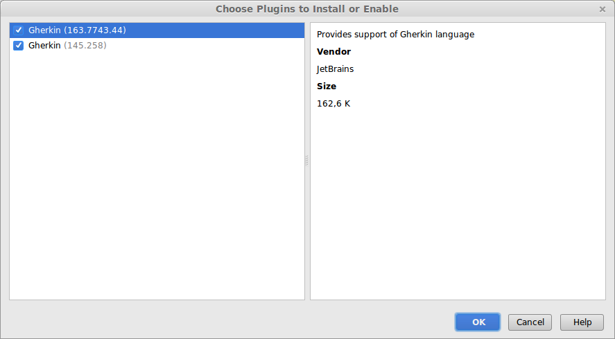
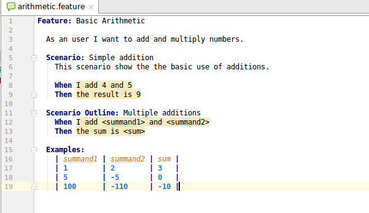

# Installing Cucumber plugin in IntelliJ

You have to install the Gherkins plugins in IntelliJ in order to have syntax highlightning to the features files.

Click on the link **Install plugins** in order to have syntax hightlightning.

You can choose both plugins and you can finish the installation.

When then installation is finished you must restart IntelliJ. You have syntax highlightning from now on.

