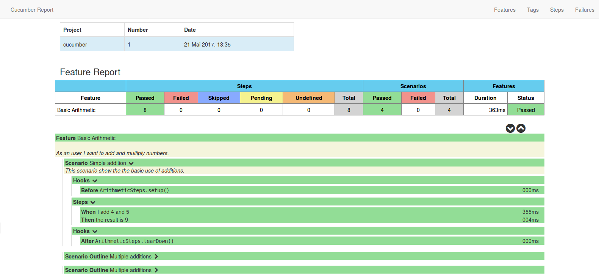

# Setup unit tests with TestNG

## Maven
 
### Dependencies

You have to add the following Maven dependencies:

```
<dependency>
  <groupId>io.cucumber</groupId>
  <artifactId>cucumber-java</artifactId>
  <version>4.2.4</version>
</dependency>
  
<dependency>
  <groupId>io.cucumber</groupId>
  <artifactId>cucumber-testng</artifactId>
  <version>4.2.4</version>
  <scope>test</scope>
</dependency>
```

If you want to product reports which is described in the section **Report** you have to add the following dependency, too:

```
<dependency>
  <groupId>net.masterthought</groupId>
  <artifactId>cucumber-reporting</artifactId>
  <version>4.4.0</version>
  <scope>provided</scope>
</dependency>
```

### Plugin configuration

The Maven plugin *Failsave* is used for processing the tests, therefore the Surefire plugin skips the tests
```
<plugin>
    <groupId>org.apache.maven.plugins</groupId>
    <artifactId>maven-surefire-plugin</artifactId>
    <configuration>
      <skipTests>true</skipTests>
    </configuration>
</plugin>
```

The Failsave plugin is executed in the phase *verifiy*. All tests which ends with the suffix *AcceptanceTests* will
be executed.

```
<plugin>
  <groupId>org.apache.maven.plugins</groupId>
  <artifactId>maven-failsafe-plugin</artifactId>
  <version>2.20</version>
  <configuration>
    <includes>
      <include>**/*AcceptanceTest.java</include>
    </includes>
  </configuration>
  <executions>
    <execution>
      <id>integration-test</id>
      <phase>integration-test</phase>
      <goals>
        <goal>integration-test</goal>
      </goals>
    </execution>
    <execution>
      <id>verify</id>
      <phase>verify</phase>
      <goals>
        <goal>verify</goal>
      </goals>
    </execution>
  </executions>
</plugin>
```

## Unit test

If you want to create an unit test you need the features file, the file with the step
definitions and the test runner file.

### Feature

The features file has the extension `.feature` and represents the feature which can consits
of serveral scenarios.


### Steps

The Java class with the steps contains the steps of the scenarios. If you want to execute
methods (hooks) before and after a scenario you can create methods with the annotations
`@Before` and `@After`.

### Test runner

The test runner file is inherited from the class `AbstractTestNGCucumberTests`.

You have to add the annotation `@CucumberOptions` to the class.

Options:
* The option *features* specifies the folder in which the features files are stored.
* The option *glue* specifies the Java package in which the step files are stored.
* The option *plugin* defines the format of the result file.

```
@CucumberOptions(
    features = "src/test/features/math",
    glue = "de.blackned.training.cucumber",
    plugin = "json:target/cucumber-report.json")
public class ArithmeticAcceptanceTest extends AbstractTestNGCucumberTests {
}
```

## Report

The Cucumber reporting Maven plugin can be used to create HTML reports.

You can used it by adding the plugin to the build tag in the `pom.xml` file.

```
<plugin>
  <groupId>net.masterthought</groupId>
  <artifactId>maven-cucumber-reporting</artifactId>
  <version>4.4.0</version>
  <executions>
    <execution>
      <id>execution</id>
      <phase>verify</phase>
      <goals>
        <goal>generate</goal>
      </goals>
      <configuration>
        <projectName>cucumber</projectName>
        <outputDirectory>${project.build.directory}/</outputDirectory>
        <jsonFiles>
          <param>**/*.json</param>
        </jsonFiles>
      </configuration>
    </execution>
  </executions>
</plugin>
```

The next image shows an example of the report of all features:


The next image shows the details of the feature *Basic Arithmetic* with its steps and hooks:

